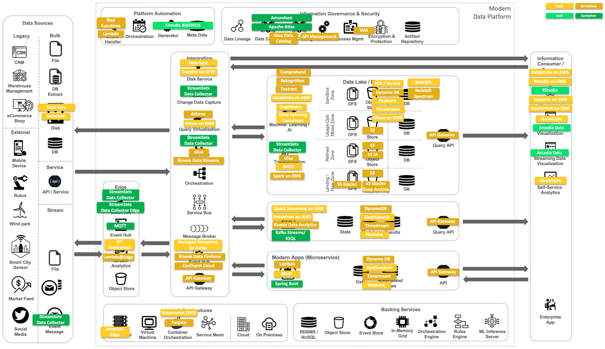

:toc: right
= Important Asciidoc Formats
== Titles

= Document Title (Level 0)

== Level 1 Section Title

=== Level 2 Section Title

==== Level 3 Section Title

===== Level 4 Section Title

====== Level 5 Section Title

== Formatting

normal, _italic_, *bold*, +mono typed+

Command: `ls -l`

....
error: The requested operation returned error: 1954 Forbidden search for defensive operations manual
absolutely fatal: operation initiation lost in the dodecahedron of doom
would you like to die again? y/n
....

== Terms, Lists

.Labeled
Term 1::
    Definition 1 dfklsdjflksdjfklj dsfdsjlkfjdlkj fdafdlj fdsfdsf sflskfjslkdjfklj dflsdkjfjsdlkj fsklajflksdjfs dsdfdsfsdlks dlfjlksdjfklsdjfkljdsklfj
Term 2::
    Definition 2

This is a bullet list

* bullet
** bullet 2
*** bullet 3

This is a numbered list:

. One
. Two
. Three: lfjkslfjklfjlj flsdfj djflsdjk dfsakfldjsa  afdfs dfsdklfldf saddfds sdffsdfd ldfdfdd fdfdsafsdf dfsdsdff sfsdfdfds sdfdsffdfd fdsfsdsdfds
. *Four*: lfjkslfjklfjlj flsdfj djflsdjk dfsakfldjsa  afdfs dfsdklfldf saddfds sdffsdfd ldfdfdd fdfdsafsdf dfsdsdff sfsdfdfds sdfdsffdfd fdsfsdsdfds

== Images

.An architecture diagram

== Tips

TIP: there are

IMPORTANT: this is important

WARNING: be careful

CAUTION: do not use

== Code Block

[source,java]
----
public class Test {
  public void main() {
    system.out.println("test");
  }
}
----

== Tables

.Table Title
|===
|Name of Column 1 |Name of Column 2 |Name of Column 3

|Cell in column 1, row 1
|Cell in column 2, row 1
|Cell in column 3, row 1

|Cell in column 1, row 2
|Cell in column 2, row 2
|Cell in column 3, row 2
|===

== Copyright

(C)
(R)

== Links

http://google.com

link:doc-2.adoc[Relative link to other document]

---

== Footnote

This is some text about an object{wj}footnote:[This is the first footnote] is found.

Big Name footnote:[This is another footnote] is found.
