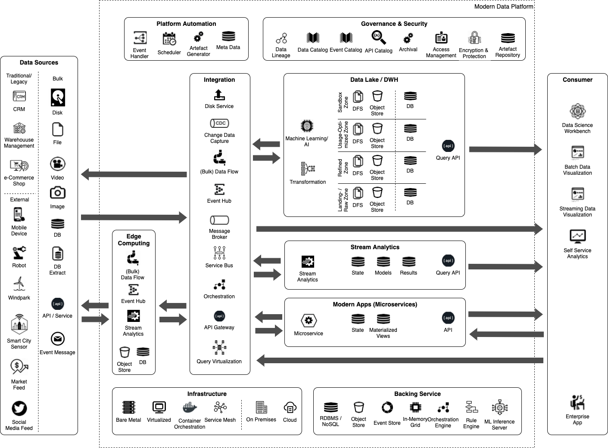

= Trivadis Reference Architecture for Modern Data Analytics Solutions

The *Trivadis Reference Architecture for Modern Data Analytics Solutions* defines a generic, vendor-neutral and common blueprint for data lake architectures.
The Trivadis Reference Architecture provides different *Solutions Modules*, which engage with the different areas of a modern data analytics solution.
Each module is first defined in a vendor-neutral form and shows and describes the architectural building blocks, which are important and critical for the implementation of a solution module.
For each solution module, we then identify *one or more Scenarios*, which presents a solution module “in action”. In a scenario, for each of the architectural building blocks a concrete technology or product is selected. By that is shows, how a solution module can be implemented on corresponding platform. This has been done for both on-premises as well as for various cloud platforms.
Before we start and delve into the architecture discussion, let’s quickly review the guiding principles for the construction of this Trivadis Reference Architecture.

*	*Keep the solution as “vendor-neutral” as possible.* All services should be chosen so that the cloud-/vendor lock-in is minimal. By that, we remain flexible and would be able to change the platform later to another cloud vendor or migrate it to an on-premises solution if needed. Additionally, it is much easier to find knowledge on a generic topic than on a vendor-specific solution. To avoid vendor lock-in, services of the cloud vendor can still be chosen, but solutions, which are based on open source software, should be preferred over services based on proprietary solutions. By that, a cloud service from the current vendor could be replaced by a service from another vendor with minimal changes, if he offers the same open source solution. This is for example possible with technologies such as Spark, Hadoop and Kafka.
*	Creating an architecture for a *single information system*, which combines *operational* and *analytical* concerns.
// We should explain why
*	*Asynchronous interface* preferred over *synchronous interfaces*.
// We should explain why
*	*Event-based/-driven instead of Polling and Scheduling.* Whenever possible, the solution should communicate with events instead of using polling-based or period scheduling-based approaches for detecting status changes.
// We should explain why
*	Solution should support the *Separation of Storage and Compute* for cost-efficiency reasons. This makes it easier to only pay for (parallel) computing when it is necessary. This is especially interesting, as with all cloud vendors, the storage costs are a significantly lower than computing cost.
// We should explain, that this might cause lower performance compared to DAS dependent on the size of the cluster and the storage interface for the benefit of lower costs and more flexibility
*	Solution supports *Automation over Manual Coding and Processes*. Whenever possible, a tool chain should be used which supports model-driven development and allows for the generating of the various artefacts which recur multiple times. This applies both for code as well as processes.
// We should explain why
*	If there are various alternative offerings available, then a *Serverless offering should have priority over a Platform-as-a-Service (PaaS) offering* and a *Platform-as-a-Service (PaaS) should have priority over an Infrastructure-as-a-Service (IaaS) offering*. By that, the cloud vendor is in charge of the infrastructure, which simplifies operating such a platform a lot. Additionally, it is also more cost-efficient, as especially in a Serverless but often also in PaaS offerings, you only pay for the resources consumed by an application.
// We should explain how this interferes with "No Cloud LockIn" and when to use which way
*	Solution should allow for *keeping all the raw data* in a logically central place, but offer an answer for *storage tiering*, i.e. separating hot, cold and archive data to benefit from lower storage rates. The separation should be as transparent as possible to the user of the stored data. By keeping the raw data as long as possible, it is possible to still go back to raw data, if some new requirements pop-up in the future, which is not known today. By keeping the “passive” raw data as close as possible to the “active”, implementing data processing, which can re-process all raw data collected since the start of the system, is much easier to implement.
// Here, the WHY is well explained
*	Supports modern architecture concepts and approaches, such as Event Streaming, Event Sourcing and CQRS to implement loosely coupled applications (a.k.a. Microservices).

When implementing a concrete solution, not all of these principles are equally relevant and some might even contradict others. There is also always a trade-off to be made when applying the different principles. Implementing a Data Lake in the cloud should follow some other rules than implementing it on-premises.
The Trivadis Reference Architecture for Modern Data Analytics Solutions, which we will use as a benchmark in this assessment is shown in Figure 1.

.Trivadis Reference Architecture for Modern Data Analytics Solutions

== Description of Layers and Building Blocks

The reference architecture consists of different layers, which group various architectural building blocks. Here a short description of all these layers and their building blocks:

// Some of these text blocks do not match the architecture any more (see "Big Data Processing" in the picture). How should we handle this?
* *Data Sources* – this layer combines the various data sources to be integrated with the data lake through various channels. The integration can be based on bulk or streaming data, and in case of bulk data, the semantics can either be a recurring full-load or a delta load.
*	*Edge Computing* – an optional layer, which can be used if some (pre)processing needs be done near or at the data source, i.e. to minimize the data to be transferred to the lake and by that reducing the burden on the network. The following building blocks are available:
**	*(Bulk) Data Flow* – allows the development and execution of modern (big) data flows. These data flows can both deal with bulk data as well as streaming data. The idea is to provide data integration between the data sources and the event hub or data store. This building block allows to perform some transformations on the messages. Traditionally this has been called ETL processing and in fact the (Bulk) Data Flow building block has some resemblance to ETL.
**	*Event Hub* – allows the buffering of data and supports the principle of publish/subscribe, e.g. a producer is writing a message into the event hub, which can then be consumed by multiple consumers (subscribers).
**	*Stream Analytics* – allows the processing directly on the event stream (data in motion) and provides analytical operations such as aggregation over time windows, event pattern detection, …
**	*Object Store* – allows storing data in a key-value like structure in an efficient and cost-effective manner.
**  *DB* - a local, ligthweight database to store information
*	*Integration* – ensures integration between the various layers. Focus is on the integration of the data sources with the data storage in the data lake, but also on the efficient and prompt forwarding of events to the Real-Time Processing Layer. The following building blocks are available:
**	*Disk Service* – provides the capability of importing large datasets (which are too large for copying them over the network in a cost- and time-efficient manner) into the data lake using one or more transportable/shippable disks. This is especially interesting if the data source and the data lake are physically distributed, i.e. if for the data lake a cloud service is used.
**	*Change Data Capture* - Refers to the process or technology for identifying and capturing changes made to a database. Those changes can then be applied to another system directly or send to an message broker or Event Hub for further distribution.
**	*(Bulk) Data Flow* – allows  development and execution of modern (big) data flows. Big data flows deal with bulk data and the main purpose is to forward these bulks of data to the Data Lake / DWH Layer. This is very much the idea of the ETL tools used in traditional data warehousing. Some of these tools have been adapted to cover big data workloads, but there is also a bunch of new tools which have been created specifically for the usage in a Data Lake scenario.
The non-bulk data flows allow for collecting and forwarding of single messages originating from an event stream and storing/publishing them either into the *Event Hub* or *Message Broker* building block.
**	*Event Hub* – allows the buffering of data and supports the principle of publish/subscribe, e.g. a producer is writing a message into the event hub, which can then be consumed by multiple consumers (subscribers).
**	*Message Broker* - a traditional messaging middleware to decouple systems through the usage of queues (1:1) or topics (1:many).
**	*Service Bus* – a building block from the area of the Enterprise Service Bus (ESB). Similar to the Process Data Flow building block, it also services the integration with traditional Enterprise Systems and less the processing and forwarding of high-volume and high-velocity event streams. For that the specific Data Flow building block should be used.
**	*Orchestration* – provides the possibility to model and execute processes. These processes can be triggered by messages arriving in the integration layer and a process itself can publish messages. By that it is also possible to model and execute data flows, similar to the Bulk Data Flow and Data Flow building blocks. But as Process Data Flow are mostly based on traditional infrastructures, they are usually much less scalable compared to the new products. Process Data Flow is more suited for integrating traditional Enterprise Systems with the data lake, to perform automatic actions based on results of the data lake.
**	*API Gateway* - An API gateway takes all API calls from clients, then routes them to the appropriate service implementation with request routing, composition, and protocol translation.
**	*Query Virtualization* – A way to query data across many systems without having to copy data into a central place but get the data from the source systems. If all the metadata and access to the underlying data is schematized and managed in one place, this is called a *Federated Database*
*	*Data Lake / DWH* – provides storage capabilities for a large amount of data in a cost-efficient way. The fundamental building block of this layer is the storage. Storage is organized into zones, which categorized the stage the data is in.  The following zones have been identified and named:
** *DFS* - a distributed filesystem, which allows for storing (large) files in a safe and reliable manner.
** *Object Store* - similar to the DFS, allowing for storing (large) objects in a safe and reliable manner. Important in a cloud deployment, as it offers to separate storage from compute. More and more support for on-premises deployments as well.
** *DB* - a database, either as a Relational Database, NoSQL, NewSQL or In-Memory data store.
provides the capabilities for processing the data in the data lake in an efficient and scalable way so that the data can be transformed from one form into another. The following building blocks are available:
**	*Transformation* - process of converting data or information from one format to another, usually from the format of a source system into the required format of a new destination system.
***	*Enrichment* – is a general term that refers to processes used to enhance, refine or otherwise improve raw data. Data which is used for enrichment can be part of the data lake or can be read on-demand from outside the data lake.
***	*Aggregation* – also known as Consolidation, is a type of data and information mining process where data is searched, gathered and presented in summarized format to achieve specific business objectives or processes and/or conduct human analysis. Aggregation can be created “on-demand” or stored in materialized form.
***	*Cleansing/Validating* – the process of detecting and correcting (or removing) corrupt or inaccurate records from a data set and refers to identifying incomplete, incorrect, inaccurate or irrelevant parts of the data and then replacing, modifying, labeling, or deleting the dirty or coarse data.

**	*Machine Learning/AI* – provides the capabilities to perform Advanced Analytics on the data stored in the data in an efficient and scalable manner. Uses algorithms to parse data, learn from that data and make informed decisions on what it has learnt.
***	*Image/Video Recognition* - the ability of software to identify objects, places, people, writing and actions in images and videos.
***	*Timeseries Analysis* - comprises methods for analyzing time series data in order to extract meaningful statistics and other characteristics of the data. Time series forecasting is the use of a model to predict future values based on previously observed values.
***	*Graph/Link Analytics* - a data analysis technique used in network theory that is used to evaluate the relationships or connections between network nodes
***	*Location Analytics* - the process or the ability to gain insight from the location or geographic component of business data.

*	*Stream Analytics* – provides the capability to process the data while still in-motion and by that getting actionable insights with minimal latency. The following building blocks are available:
**	*Stream Analytics* - allows the processing directly on the event stream (data in motion) and provides analytical operations such as aggregation over time windows, event pattern detection, …
**	*State* – master / meta data held in a cache so that is available in an efficient manner when processing streaming data, such as to be able to enrich streaming data.
**	*Models* – a machine learning trained model, which is expected to perform some intelligent stuff to be used from a pipeline implemented by the Stream Analytics building block.
**	*Results* – actionable insight which needs to available later can be stored here. This data is prepared in a way that it can directly serve the data access from the consuming systems.
*	*Modern Apps (Microservices)* – provides an environment for developing and running applications which are served with data / results from the data lake. The following building blocks are available:
**	*Microservice* – an application with a clear bounded context, providing some specialized, fine-grained functionality mostly on the data/results stored in the data lake.
**	*Usage-Optimized Data* - actionable insight which needs to be available in a read-only fashion by the microservices are kept here (materialized views). This data is prepared in a way that it can directly serve the data access from the consuming microservices.
*	*Information Consumer* - The following building blocks are available:
**	*Data Science Lab* - term for certain kinds of initial analysis and findings done with data sets, usually early on in an analytical process. It can be described as “taking a peek” at the data to understand more about what it represents and how to apply it.
**	*Batch Data Visualization* - the process of displaying stored data/information in graphical charts, figures, maps and bars.
**	*Streaming Data Visualization* - the process of displaying streaming as well as stored data/information in graphical charts, figures, maps and bars.
**	*Self-Service Analytics* - an approach to advanced analytics that allows business users to manipulate data to spot business opportunities, without requiring them to have a background in statistics or technology
*	*Master Data* – provides the relevant master and reference data to the data lake, which is often necessary in the processing and analytics of the data. The following building blocks are available:
**	*API / Service* - the technique for providing access to data over clearly defined and governed interfaces. Today typically REST interfaces providing JSON data are in use with the potential extension with GraphQL.
**	*Master Data* – the database persisting the master-/reference-data.
// Where is Metadata management / governance described?
*	*Enterprise Apps* – all existing, traditional applications of an enterprise. The following building blocks are available:
**	*API / Service* - the technique for providing access to data over clearly defined and governed interfaces.
**	*Data* – the data stored by an enterprise application, either as a file or in form of a relational database.
**	*Enterprise App* – any traditional, existing application or system used in an enterprise, such as an ERP solution.

* *Platform Automation* -
**	*Event Handler* – provides a simple solution for reacting on a “storage event” in the Big Data Storage, i.e. when a new object/file is stored in one of the zones and to start some processing based on that event. One way for implementing this building block is in a «serverless» manner, where an infrastructure is in place, which allows to execute functions triggered by an event.
**	*Scheduler* – provides the capability for the periodic starting and orchestrating batch jobs.
**  *Artefact Generator* - capabilities for generating artefacts such as code and infrastructures.
**  *Meta Data* -

* *Governance & Security* - provides services around governance and security of the data platform.
** *Data Lineage* - describe what happens to data as it goes through diverse processes. Data lineage can help with efforts to analyze how information is used and to track key bits of information that serve a particular purpose.
** *Data Catalog* - provides metadata information on the information stored in the data platform.
** *Event Catalog* - provides metadata information on the events which flow through the data platform.
** *API Catalog* - provides metadata information on the APIs offered as part of the data platform as well as from external systems.
** *Archival* - manages the data lifecylce of information and makes sure the "temperature" of the data (hot, warm, cold) changes according to business needs.
** *Access Management* - manages and controls who has access to which kind of information.
** *Encryption & Protection* - provides the capabilities to encrypt and protect the information which is stored on the data platform as well as the information which flows through the data platform.
** *Artefact Repository* - provides a repository to store artefacts, such as code (version control), libraries (maven repository) or container images (image repository).

* *Infrastructure* - providing infrastructure services where the Data Platform runs on.
* *Backing Service* - services used by the other layers such as various data stores, rule engines, ...

* *Consumer* - the consumers of the information held / provided by the data platform

// If this should be the pendant of the Transformation in Data Warehousing, it is much more than just changing the format. It includes all operations required to integrate and historize the data like joins, set operations, splitter, filter, aggregations, partitioning, pivoting and unpivoting,  functions and much more. If this is NOT the pendant to DWH Transformation, where is it described?
//*	*Big Data Federation* – provides the capability to access data stored in the data lake from external in a safe and simple manner. By that traditional, standard data analytics and visualization utilities can be used to access the data. The following building blocks are available:
//**	*Query Engine* – provides the necessary functionality for accessing data by using a query language. The kind of query language is dependent on the underlying storage technology, but most often a SQL dialect is supported.
//**	*API / Service* – the technique for providing access to data over clearly defined and governed interfaces. Today typically REST interfaces providing JSON data are in use with the potential extension with GraphQL.

//*	*Enterprise Data Warehouse* – this layer is a placeholder for a traditional, existing Data Warehouse, which can be integrated with the data lake. The Data Warehouse bases on its existing Blueprints. The following building blocks are available:
//**	*RDMBS* – a relational Database, which is often the base for the storage of the data in a Data Warehouse.
//**	*Multi-Dimensional* – a specific type of database that has been optimized for data warehousing and OLAP (online analytical processing).
//**	*App Marketplace* – a digital distribution platform for microservices-based applications.

The storage zones are the following

*	*Landing Zone* - an optional zone where the data lands before it is moved into the raw zone. Common in highly regulated environments where the data has to go through some initial quality check before it can be stored. Only limited access is provided.
*	*Archived Zone* – data which should be preserved, even after it has been fully processed, but which does not have to be available immediately. It will take a few hours for the data to be made online and available.
*	*Raw Zone* – the zone where the raw data is stored and kept as the original source data. Raw data can be optionally moved into an Archived Zones if no longer needed in regular processing.
*	*Refined Zone* – the zone where data is altered so that it follows all government and industry policies, as well as checked for quality. Standard data cleansing and data validation methods are performed here.
*	*Usage Optimised Zone* – manipulated and enriched data is kept in this zone. This data is prepared in a way that it can directly serve the data access from the consuming systems.
*	*Sandbox Zone* – this zone is primarily explored by data science teams. Provide the computing required for data scientists to tackle typically complex analytical workloads.

The Trivadis Reference Architecture with its layers and building block offers a universal blueprint for analytics solutions. But not all data lake projects will need all the building blocks at the beginning or at all. To be able to communicate and decide what is needed for a given data lake project, various solution modules have been identified.

== Solution Modules

Each solution module bundles a set of requirements needed by a data lake. A solution module covers a specific aspect of a data lake solution.

The following table defines the 14 different solution modules we have identified so far.

[width="100%",cols="2,3,10",options="header"]
|===================================================
|ID |Module Name |Module Description
|M1 |Batch Data Ingestion |Supports the ingestion of bulk data into the data lake.
The end-to-end latency should not be the  concern here, the focus is on efficiency and throughput.
It’s of course the right fit if a data source can only provide bulk data, often by extracting data to a file first and then loading the file via this module into storage, most often provided by *M3: (Big) Data Storage*.
|M2	|Stream Data Ingestion |Supports to tap events from a high-volume and high-velocity data stream. Here the focus is on minimal latency and less on overall throughput. Also of importance is retrieving the events in a secure, efficient and reliable way and forwarding the events as quick as possible (low latency). This module does not cover any storage as well as processing/analytics of the data, for that either *M3: (Big) Data Storage* or *M6: Stream Analytics* can be used. Most of the time the data arriving is immediately buffered by a component provided by *M17: Event- / Message-Integration* from where it can be pushed to other systems using *M10: Pushing Data to Target Systems*
|M3	|(Big) Data Storage |Supports long term storage of data, a.k.a. Data Lake. Provides various storage technologies, optimised for the different data access requirements with varying pricing concerns.
|M4	|(Big) Data Processing |Supports processing of the large datasets persisted in the various data stores of *M4: (Big) Data Storage*. The focus here is on the efficient and scalable transformation of data stored by *M4: (Big) Data Storage* and by that move it from one zone to another/the next zone.
|M5	|Analytics and Machine Learning |Supports Advanced Analytics, such as Machine Learning, Natural Language Processing (NLP), Deep Learning, AI on the data stored on the Data Platform. The output of the Analytics, i.e. a Machine Learning Model is also stored by *M4: (Big) Data Storage* and by that made available to any users of the model, which can be again in Batch using *M4: (Big) Data Processing* or more often in real-time by *M6: Stream Analytics* or *M9: Modern Applications (Micro- / Mini-Serices).
|M6	|Stream Analytics |Offers the processing of events directly on the data stream, without having to persist the events before hand. The focus here is on velocity, a single event should be processed as quick as possible, to offer actionable insights with minimal latency.
|M7	|Invoke External System	 |Allows the integration of traditional systems with the data lake as well as calling-back to modern data sources, such as IoT devices. This modules is used to send/execute actionable insights from *M6: Stream Analytics* and *M9: Modern Applications* as well
as to support the «way back» to a data source. This is the case with IoT devices, where a so called Actuator is invoked in order to control the device. The focus here is on the addressability of a single data source and the reliable communication with that data source from the Data Platform.
|M8	|Edge Processing |Provides the capabilities to run part of storage, processing and analytics on the Edge layer. The goal here is to move these capabilities to the Edge in order to minimize latency, i.e. if the actionable insight of the data processing has a direct impact back on the data source (i.e. triggering the Actuator on an IoT device). In that case, the time for a roundtrip from the data source all the way into the central Data Platform and back to the source might take to long for the use case in mind. Another use case for using an Edge Layer is to reduce the necessary bandwidth on the network. Instead of sending all the information to the central data platform, the informations is pre-filterd on the Edge Layer and only the relevant information is sent, whereas the other information is either lost or stored on the Edge Layer for some time.
|M9	|Modern Applications (Micro- and Mini-Services) |Provides a platform for developing, provisioning and running modern, loosely coupled applications, which are primarily powered by data and results within the Data Platform. The focus here is on ease of use, both for the developer as well as for the end-user of the application.
|M10 |Pushing Data to Target Systems |Provides the capabilities to push information to other modules of the Data Platform, such as *M3: (Big) Data Storage*, *M6: Stream Analytics* or *M9: Modern Applications* as well as external systems.
In this solution module the data is pushed to the external system, whereas in *M11: Accessing the Data Lake* as well as *M12: Data Federation and Virtualization* the data is pulled by the external systems.
|M11 |Accessing the Data Lake |Supports a standardized access of the data lying in the various zones provided by *M4: (Big) Data Storage*. The focus is on simplicity of data access. This can be useful for traditional reporting, analytics or visualization tools as well as new applications being implemented on top of the data lake (provided my *M9: Modern Applications*). In this solution module the data is pulled from the external systems, whereas in *M10: Pushing Data to Target Systems* the data is pushed from the data platform to the external systems.
|M12 |Data Federation and Virtualization |Provides functionality to allow for data from multiple data lakes and other data sources to be queried and combined. It is especially important for data which is hard to integrate.
|M13 |Orchestrating the Data Platform |Provides functionality necessary for the plumbing associated with long-running processes, that is both needed for modules *M4:(Big) Data Processing* and *M5: Analytics & Machine Learning. It handles the chaining of tasks, their automation and how to deal with failures. The tasks can be anything, like processing jobs, machine learning jobs, dumping data in and out of a database and much more. Triggers can be both time-based as well as event-based.
|M14 |Automating the Data Platform |Provides functionality for the automation of repetitive development tasks. This can be the generation of logic, such as data flows controlling the data ingestion or transformations of the data between the various zones. The focus is on reduction of manually copy/paste creation of artifacts, providing the capability for a global regenerate in case of fundamental changes to tools and their usage.
|M15 |Govern the Data Platform |Supports the necessary task for managing the data lake, such as the various aspects of Data Governance, i.e. managing assets in a Data Catalog, providing Data Lineage, … but also aspects of DataOps.
|M16 |Securing the Data Platform |Provides the necessary functionality to protect the data lake and the data stored within.
|M17 |Event- / Message-Integration |Provides the necessary tools and components for integrating applications by messages and events.
|M18 |Event- / Application Integration |Provides the necessary tools and components for integrating applications over service calls.
|===================================================

Figure 2 shows these 18 solution modules in context of the *Trivadis Reference Architecture*.

.Trivadis Reference Architecture for Modern Data Analytics Solutions – different solution modules

All modules are presented as an overlay on top of the diagram from Figure 1. This is no exact science; it should provide the reader an idea on the areas of the reference architecture which are covered by a given solution modules.

For each solution module, we have created a separate diagram, which only highlights parts which are needed from the Reference Architecture but in more detail. These diagrams are still vendor neutral and use the same basic building blocks from the Reference Architecture.

*needs to be redrawn, once diagrams for solution modules are finished*

.Trivadis Reference Architecture for Modern Data Analytics Solutions – a diagram per solution module
image::images/trivadis-ref-architecture-solution-modules2.png[alt="not bad.",width=1024,height=1024]

In the next section we delve into some options for adapting from a traditional, batch-based data lake with high latency into a more reactive data lake, updated in near real-time.

== Mapping to Cloud Services

The Trivadis Reference Architecture can be implemented on-premises using various Vendor and Open Source technologies as well as in the cloud.

In this section we visually show the mapping of AWS and Azure cloud services to the Reference Architecture.

Figure 4 shows the mapping of AWS services to the Reference Architecture.

.Trivadis Reference Architecture – Mapping to AWS Services
image::images/trivadis-ref-architecture-aws-mapping.png[alt="not bad.",width=1024,height=1024]

Figure 5 shows the mapping of Azure services to the Reference Architecture.

.Trivadis Reference Architecture – Mapping to Azure Services
image::images/trivadis-ref-architecture-azure-mapping.png[alt="not bad.",width=1024,height=1024]

Figure 6 shows the mapping of Oracle services to the Reference Architecture.

.Trivadis Reference Architecture – Mapping to Azure Services

// Don't we need an On-Prem Mapping too?
