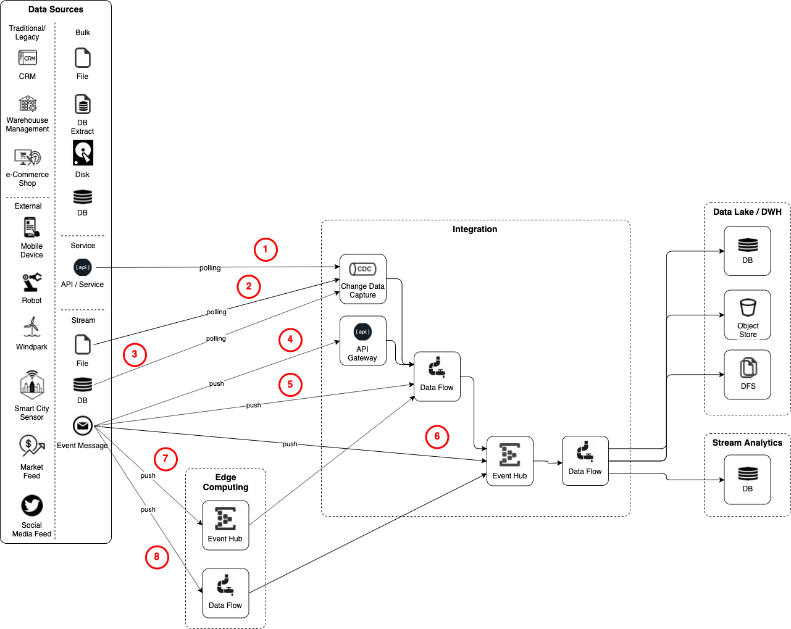

# M2: Stream Data Ingestion

## Motivation
// Writing a short text what is the ultimate neccessity of Stream Data ingestion, Why we need it and how it differentiates to other modules.
One of the several V’s in Big Data is *Velocity*. It stands for the speed in which today's modern, streaming data sources produce new data.
The source for streaming data is either

* *Native Streaming Data Source* - a data sources which pushes relatively small volume of data in short intervals, also known as event. These messages are often transient, meaning that they are not persisted by the data source and "only" sent once. Such streaming data sources are IoT devices, machines in an Industry 4.0 setup, social media feeds, financial data feeds and many more.
* *More traditional, data-at-rest based system with change data capture capabilities* - a traditional system which persists data in a storage system, which can either be a database or a file. These are the systems which are often being used as data sources by module M1: Batch Data Ingestion.

*M2: Stream Data Ingestion* covers the flow of data from the data sources to one of the componentes inside the *Integration* layer. Normally this will be a *Data Flow* component if the data is not kept in a structured log or an *Event Hub* if the data should be persisted in a structured log to increase reliability.
To send the data to target systems, *M10: Pushing Data to target system* can be used and combined with this module.

The following diagram provides an overview of the various ways data can be provided in a streaming fashion.

.M2: Stream Data Ingestion Overview

The flows have the following meaning

1. *Polling an API* - an API, such as a REST Service provides a way to get changes
2. *Polling a File* - changes on a File are retrieved either by doing a tail on a "live" file or by polling for new files
3. *Polling a database* - a database provides a way to get changes over its query API
4. *Pushing Events over an API* - events are sent by the source to an API, possibly a REST API provided by the integration layer
5. *Pushing Events into a Data Flow component* - events are sent over some protocol, with the listener being an Data Flow component
6. *Pushing Events into Event Hub* - events are sent directly to the Event Hub by the data source
7. *Pushing Events into Event Hub in Edge Computing* - event are sent directly to an Event Hub on the Edge Layer
8. *Pushing Events into a Data Flow component in Edge Computing* -

## General concepts
// -- General concepts that are important here as it is the actual part where the further reader (solution architect) should find his demand.
// -- It should be explained where the data is coming from, what (in general) we want to do with it and how we can do it, finally where the output goes to.
// -- For example in Big Data ingestions it is reading from relational sources as batch (with some intelligence maybe). But also beeing able to ingest large unstructered datasets from just file systems, like images, audios or videos.

## Typical Patterns
// -- the ingestion modules should describe as well the sources and the targets that might occour in a generic way (but not too generic). For example we can mention in the Big Data ingestion, that there is often the need to run it on a schedule and use the current time in the load. Or that ingesting files can be also that they have to be loaded from a smb/nfs/s3 whatever first. Or also there might be public connection, so we need to have Internet connection etcetc.
// -- Mention the DataCatalog from the Module M15: Govern the Data Lake (also in the best practices)
There are several typical patterns in this module that can be applied.

### Data Transformation

### Database polling

### File Polling

## Best Practices
//-- the best practice should give a summary over the typical patterns but discusses them more in detail. E.g. in the Big Data ingestion also discuss how to do a delta or incremental update, or even using change data capture on the database.
//-- Mention the DataCatalog
//-- Also dicsuss some anti-patterns and misunderstandings
t.b.d.

## Architectural requirements & functional capabilities of the tools
//-- From the patterns you can derive the functional capabilities of the tools and explore them in a more general manner.
//-- The architectural requirements will be a zoom-out version of the actual requirements (e.g. it needs to be able to run in a distributed mode and maybe also standalone, It can be run in a container for CI/CD) Metrics are exposed to the outside.

## Tooling
There exist several tools that satisfy the architectural requirements of the big data ingestion module. Some of the tools (e.g. sqoop) satisfy only parts of the required functionality but can be complemented with other tools to satisfy the requirements.
In general there exist three categories of ingestion tools:

* Coded
* Low-Code
* Flow-based

The categories are not exclusive, but overlapping.

In the following there are exemplary tools presented for each of the categories with a possible runtime environment.
